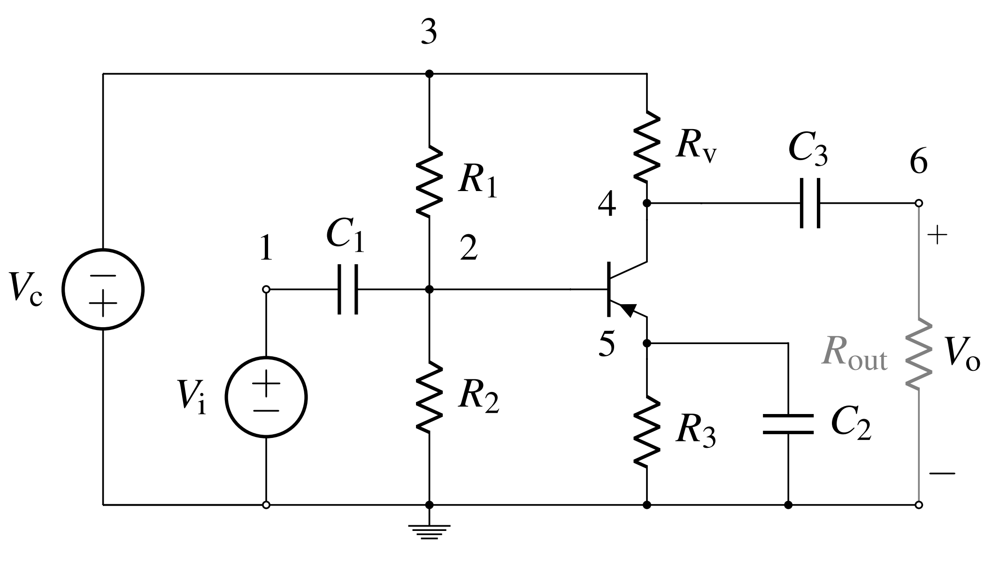

## Ebers-Moll BJT model

\begin{align}
	I_{\mathrm{b}} & = \frac{I_{\mathrm{s}}}{\beta_{\mathrm{f}}}\left(\mathrm{e}^{\frac{V_{\mathrm{eb}}}{NV_{\mathrm{t}}}} - 1\right) + \frac{I_{\mathrm{s}}}{\beta_{\mathrm{r}}}\left(\mathrm{e}^{\frac{V_{\mathrm{eb}} - V_{\mathrm{ec}}}{NV_{\mathrm{t}}}} - 1\right)
	\\[0.5em]
	I_{\mathrm{c}} &= I_{\mathrm{s}}\left(\mathrm{e}^{\frac{V_{\mathrm{eb}}}{NV_{\mathrm{t}}}} - 1\right) - I_{\mathrm{s}}\frac{\beta_{\mathrm{r}} + 1}{\beta_{\mathrm{r}}}\left(\mathrm{e}^{\frac{V_{\mathrm{eb}} - V_{\mathrm{ec}}}{NV_{\mathrm{t}}}} - 1\right).
\end{align}

## Nodal Equations
Let the convention for this derivation be that current exiting a node is positive.

\begin{align}
	C_1\frac{d}{dt}(V_1 - V_2) - I_\mathrm{in} &= 0\\
	 \frac{V_2}{R_3} - \frac{V_3 - V_2}{R_1} - C_1\frac{d}{dt}(V_1 - V_2) &= -I_\mathrm{b}\\
	\frac{V_3 - V_2}{R_1} + \frac{V_3 - V_4}{R_4} - I_\mathrm{cc} &= 0	\\
	C_3\frac{d}{dt}(V_4 - V_6) - \frac{V_3 - V_4}{R_4} &= -I_\mathrm{c}\\
	\frac{V_5}{R_3} + C_2 \frac{dV_5}{dt} &= I_\mathrm{b} + I_\mathrm{c}\\
	\frac{V_6}{R_5} - C_3\frac{d}{dt}(V_4 - V_6) &= 0
\end{align}

## Parameter vector and Exhaustive summaries

\begin{equation}
	\theta = [R_1,\;\; R_2,\;\; R_3,\;\; R_4,\;\; C_1,\;\; C_2,\;\; C_3,\;\; I_\mathrm{s},\;\; \beta_\mathrm{f},\;\; \beta_\mathrm{r},\;\; N]
\end{equation}

Not reduced.

\begin{align}
	\kappa = [C_1,\;\; 1/R_3,\;\; &-C_1,\;\; 1/R_1,\;\; 1/R_4,\;\; C_3,\;\; -1/R_4,\\
			\;\; &C_3,\;\; -1/R_4,\;\; 1/R_3,\;\; C_2,\;\; C_3,\;\; I_\mathrm{s}/\beta_\mathrm{f} ,\;\; I_\mathrm{s}/\beta_\mathrm{r},\;\; I_\mathrm{s},\;\; I_\mathrm{s}(\beta_\mathrm{F} + 1)/\beta_\mathrm{f},\;\; 1/N]
\end{align}

Reduced.

\begin{align}
	\kappa = [1/C_1R_3,\;\; &1/C_1R_1,\;\; 1/C_1R_4,\;\; C_3/C_1,\;\; -1/C_1R_4,\\
			\;\; &C_3/C_1,\;\; -1/C_1R_4,\;\; 1/C_1R_3,\;\; C_2/C_1,\;\; C_3/C_1,\\\;\; &I_\mathrm{s}/C_1\beta_\mathrm{f},\;\; I_\mathrm{s}/C_1\beta_\mathrm{r},\;\; I_\mathrm{s}/C_1,\;\; I_\mathrm{s}(\beta_\mathrm{F} + 1)/C_1\beta_\mathrm{f},\;\; 1/N]
\end{align}

